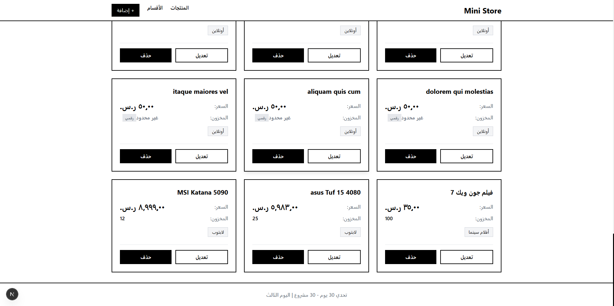

# Mini Store Frontend - واجهة المتجر الإلكتروني

واجهة أمامية لمشروع المتجر الإلكتروني المصغر (Mini Store API) - اليوم الثالث من تحدي "30 يوم 30 مشروع".

## اسم الفكرة

نظام إدارة منتجات متعدد التصنيفات (Many-to-Many) مع واجهة مستخدم عصرية بالأبيض والأسود.

## صورة المشروع



## التقنيات المستخدمة

- **Next.js 16** - إطار عمل React
- **TypeScript** - للكتابة الآمنة
- **Tailwind CSS 4** - للتنسيق
- **Axios** - للتواصل مع API

## المميزات

- عرض المنتجات في شبكة Grid
- إدارة الأقسام (إضافة، تعديل، حذف)
- إدارة المنتجات (إضافة، تعديل، حذف)
- اختيار أقسام متعددة للمنتج الواحد
- Toast Notifications للإشعارات
- Confirm Dialog مخصص للحذف
- تصميم RTL للعربية
- ثيم أبيض وأسود عصري

## طريقة التشغيل

1. تثبيت الحزم:

```bash
npm install
```

2. تشغيل السيرفر:

```bash
npm run dev
```

3. افتح المتصفح: [http://localhost:3000](http://localhost:3000)

> **ملاحظة:** تأكد من تشغيل الـ Backend أولاً على المنفذ 8000.

## هيكل المجلدات

```
frontend/
├── app/
│   ├── layout.tsx          # التخطيط الرئيسي
│   ├── page.tsx             # صفحة المنتجات
│   ├── globals.css          # الأنماط العامة
│   ├── categories/          # صفحة الأقسام
│   └── products/            # صفحات المنتجات
├── components/
│   ├── ProductList.tsx      # قائمة المنتجات
│   ├── ProductCard.tsx      # بطاقة المنتج
│   ├── ProductForm.tsx      # نموذج المنتج
│   ├── CategoryList.tsx     # قائمة الأقسام
│   ├── Toast.tsx            # الإشعارات
│   └── ConfirmDialog.tsx    # مربع التأكيد
└── lib/
    └── api.ts               # إعدادات Axios
```
