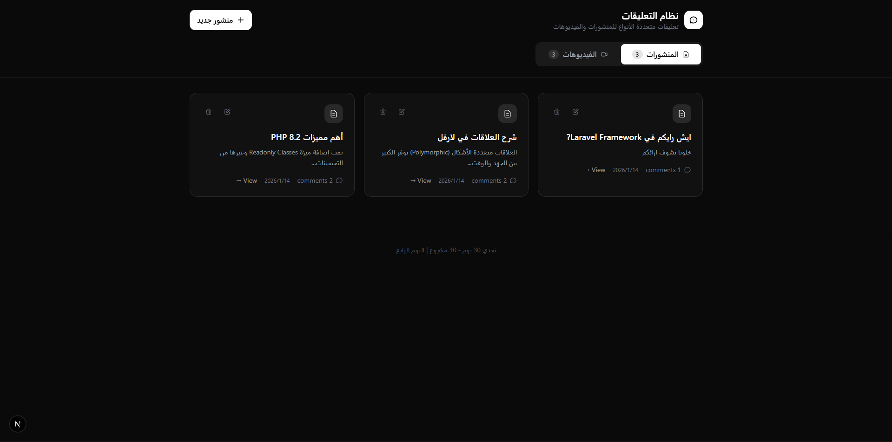

# نظام التعليقات المتعددة | Polymorphic Comments System



## الفكرة

نظام تعليقات متعدد الأنواع (Polymorphic) يسمح بإضافة تعليقات على المنشورات والفيديوهات باستخدام علاقة polymorphic واحدة في قاعدة البيانات.

---

## المميزات

- عرض قائمة المنشورات والفيديوهات
- إنشاء منشورات وفيديوهات جديدة
- تعديل وحذف المنشورات والفيديوهات
- نظام تعليقات polymorphic موحد
- إضافة، تعديل، وحذف التعليقات
- Toast notifications لجميع العمليات
- تصميم عصري باللون الأسود والأبيض
- دعم كامل للغة العربية (RTL)
- تصميم متجاوب (Responsive)

---

## التقنيات المستخدمة

### Frontend

- **Next.js 16** - React Framework
- **React 19** - UI Library
- **TypeScript 5** - Type Safety
- **Tailwind CSS 4** - Styling
- **Axios** - HTTP Client
- **React Hot Toast** - Notifications

### Backend

- **Laravel** - PHP Framework
- **MySQL** - Database
- **Polymorphic Relations** - للتعليقات

---

## هيكل المشروع

```
frontend/
├── app/
│   ├── layout.tsx          # Layout الرئيسي (RTL)
│   ├── page.tsx             # الصفحة الرئيسية
│   ├── globals.css          # الأنماط العامة
│   ├── posts/[id]/page.tsx  # تفاصيل المنشور
│   └── videos/[id]/page.tsx # تفاصيل الفيديو
├── components/
│   ├── CommentSection.tsx   # قسم التعليقات
│   ├── PostCard.tsx         # بطاقة المنشور
│   ├── VideoCard.tsx        # بطاقة الفيديو
│   ├── CreatePostForm.tsx   # نموذج إنشاء منشور
│   └── CreateVideoForm.tsx  # نموذج إضافة فيديو
└── lib/
    └── api.ts               # إعدادات API
```

---

## طريقة التشغيل

### 1. تشغيل Backend (Laravel)

```bash
cd backend
php artisan serve
```

سيعمل على: `http://127.0.0.1:8000`

### 2. تشغيل Frontend (Next.js)

```bash
cd frontend
npm install
npm run dev
```

سيعمل على: `http://localhost:3000`

---

## API Endpoints

| Method | Endpoint            | الوصف               |
| ------ | ------------------- | ------------------- |
| GET    | `/api/posts`        | جلب جميع المنشورات  |
| POST   | `/api/posts`        | إنشاء منشور جديد    |
| GET    | `/api/posts/:id`    | جلب منشور محدد      |
| PUT    | `/api/posts/:id`    | تحديث منشور         |
| DELETE | `/api/posts/:id`    | حذف منشور           |
| GET    | `/api/videos`       | جلب جميع الفيديوهات |
| POST   | `/api/videos`       | إضافة فيديو جديد    |
| GET    | `/api/videos/:id`   | جلب فيديو محدد      |
| PUT    | `/api/videos/:id`   | تحديث فيديو         |
| DELETE | `/api/videos/:id`   | حذف فيديو           |
| POST   | `/api/comments`     | إضافة تعليق         |
| PUT    | `/api/comments/:id` | تحديث تعليق         |
| DELETE | `/api/comments/:id` | حذف تعليق           |

---

## الصفحات

1. **الصفحة الرئيسية** - عرض المنشورات والفيديوهات مع tabs للتنقل
2. **تفاصيل المنشور** - عرض المنشور مع التعليقات
3. **تفاصيل الفيديو** - عرض الفيديو (مع دعم YouTube) مع التعليقات

---

## التصميم

- **ألوان**: أسود وأبيض (Dark Theme)
- **اتجاه**: RTL للغة العربية
- **خطوط**: Geist Sans & Mono
- **تأثيرات**: Hover animations, Transitions

---

## Day 04 - Laravel 30 Days Challenge

هذا المشروع هو جزء من تحدي 30 يوم Laravel لتطوير مهارات البرمجة.
