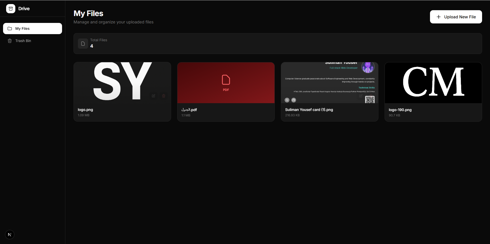

# مدير الملفات الذكي - واجهة المستخدم (Smart File Manager - Frontend)

## اسم الفكرة

**واجهة مستخدم حديثة لنظام إدارة الملفات (Modern File Manager UI)**

## الصورة



## شرح الفكرة

واجهة مستخدم عصرية مبنية بـ Next.js لإدارة الملفات، مستوحاة من تصميم Google Drive.
تتصل الواجهة بـ Laravel API لتوفير تجربة متكاملة لرفع وإدارة الملفات.

## المميزات

1. **رفع الملفات:** دعم رفع صور ومستندات متعددة الصيغ
2. **عرض الملفات:** شبكة بطاقات جميلة مع معاينة للصور
3. **سلة المحذوفات:** استعراض واستعادة الملفات المحذوفة
4. **إعادة التسمية:** تعديل أسماء الملفات بسهولة
5. **تصميم عصري:** وضع داكن، تأثيرات سلسة، واجهة نظيفة

## التقنيات المستخدمة

- **Next.js 16** - إطار عمل React
- **TypeScript** - للكتابة الآمنة
- **Tailwind CSS** - للتصميم
- **Axios** - للاتصال بالـ API

## التشغيل

1. تثبيت الاعتمادات:

   ```bash
   npm install
   ```

2. تشغيل السيرفر:

   ```bash
   npm run dev
   ```

3. فتح المتصفح على: `http://localhost:3000`

## ملاحظة

تأكد من تشغيل الـ Backend (Laravel API) على `http://127.0.0.1:8000` قبل استخدام الواجهة.
