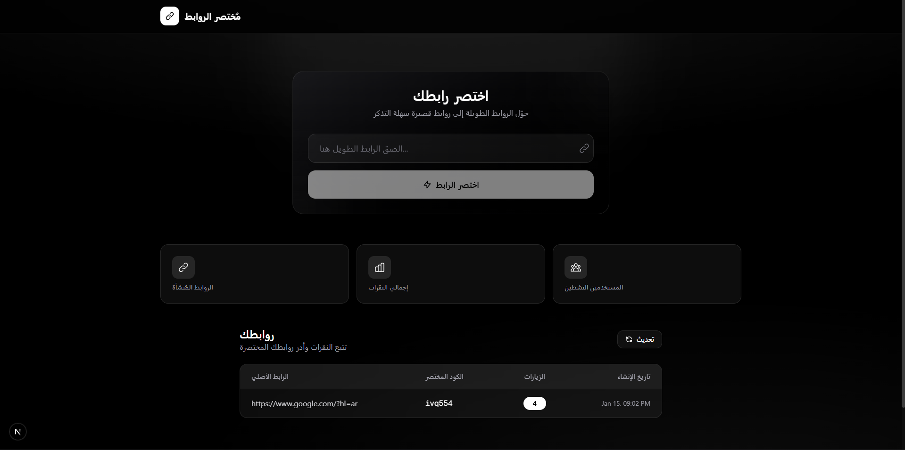

# مُختصر الروابط - LinkShort



## وصف المشروع

مُختصر الروابط هو تطبيق ويب حديث يتيح لك تحويل الروابط الطويلة إلى روابط قصيرة سهلة التذكر والمشاركة. يوفر التطبيق واجهة مستخدم أنيقة وسريعة مع إمكانية تتبع عدد النقرات على كل رابط.

## المميزات

- اختصار الروابط الطويلة بنقرة واحدة
- تتبع عدد الزيارات لكل رابط
- نسخ الرابط المختصر بسهولة
- واجهة مستخدم عصرية وجذابة
- تصميم داكن أنيق
- أداء سريع وسلس

## التقنيات المستخدمة

- **Next.js 15** - إطار عمل React للإنتاج
- **TypeScript** - للكتابة الآمنة للأنواع
- **Tailwind CSS** - لتصميم واجهة المستخدم
- **Axios** - للتواصل مع الـ API

## تشغيل المشروع

```bash
# تثبيت المتطلبات
npm install

# تشغيل خادم التطوير
npm run dev
```

ثم افتح [http://localhost:3000](http://localhost:3000) في المتصفح.

## هيكل المشروع

```
frontend/
├── app/                 # صفحات التطبيق
│   ├── layout.tsx      # التخطيط الرئيسي
│   └── page.tsx        # الصفحة الرئيسية
├── components/          # المكونات
│   ├── LinkList.tsx    # قائمة الروابط
│   ├── ShortenerForm.tsx # نموذج الاختصار
│   └── Toast.tsx       # إشعارات التنبيه
├── lib/                 # المكتبات المساعدة
│   └── api.ts          # التواصل مع الـ API
└── public/              # الملفات العامة
```

## الـ Backend

يتطلب هذا المشروع تشغيل الـ Backend (Laravel) على البورت 8000.

---

**تحدي 30 يوم 30 مشروع : مشروع اليوم السادس**
