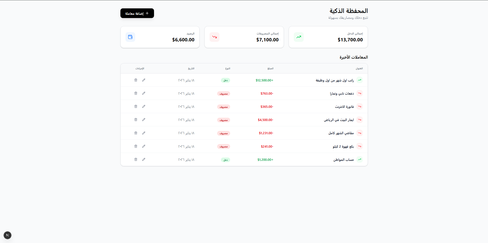

# المحفظة الذكية - الواجهة الأمامية

<div align="center">



   

**تحدي 30 يوم 30 مشروع - اليوم 9**

</div>

---

## نظرة عامة

لوحة تحكم مالية حديثة لإدارة المصاريف الشخصية. واجهة مستخدم عصرية تعرض الإحصائيات المالية وتتيح إدارة المعاملات بسهولة وسلاسة.

## المشكلات التي يحلها

| المشكلة            | الحل                                  |
| ------------------ | ------------------------------------- |
| صعوبة تتبع الرصيد  | بطاقات إحصائية واضحة للدخل والمصروفات |
| إدارة المعاملات    | جدول تفاعلي مع أزرار تعديل وحذف       |
| إضافة بيانات       | نافذة منبثقة سهلة الاستخدام           |
| التوافق مع الأجهزة | تصميم متجاوب للجوال والحاسوب          |

## المميزات التقنية

`Client Components` `Axios Integration` `Modal System` `Responsive Design` `RTL Support`

## هيكل المشروع

```
frontend/
├── app/
│   ├── page.tsx                     # الصفحة الرئيسية
│   ├── layout.tsx                   # التخطيط الأساسي
│   └── globals.css                  # الأنماط العامة
├── components/
│   └── dashboard/
│       ├── StatsCards.tsx           # بطاقات الإحصائيات
│       ├── TransactionTable.tsx     # جدول المعاملات
│       └── TransactionModal.tsx     # نافذة الإضافة/التعديل
├── lib/
│   └── api/
│       ├── axios.ts                 # إعداد Axios
│       └── index.ts                 # خدمات API
├── types/
│   └── index.ts                     # تعريفات TypeScript
└── public/
    └── home.png                     # صورة المشروع
```

## المكونات الرئيسية

| المكون           | الوظيفة                                  |
| ---------------- | ---------------------------------------- |
| StatsCards       | عرض إحصائيات الدخل والمصروفات والرصيد    |
| TransactionTable | جدول المعاملات مع إجراءات التعديل والحذف |
| TransactionModal | نافذة إضافة وتعديل المعاملات             |

## التثبيت والإعداد

### 1. تثبيت الحزم

```bash
npm install
```

### 2. تشغيل الخادم

```bash
npm run dev
```

> التطبيق يعمل على: `http://localhost:3000`

## الاتصال بالـ API

| الوظيفة          | المسار                          |
| ---------------- | ------------------------------- |
| إحصائيات المحفظة | `GET /api/wallet/stats`         |
| قائمة المعاملات  | `GET /api/transactions`         |
| إضافة معاملة     | `POST /api/transactions`        |
| تعديل معاملة     | `PUT /api/transactions/{id}`    |
| حذف معاملة       | `DELETE /api/transactions/{id}` |

## متطلبات التشغيل

- Node.js 18+
- تشغيل Backend API على `http://127.0.0.1:8000`

---

<div align="center">

**صُنع ضمن تحدي 30 يوم 30 مشروع**

</div>
