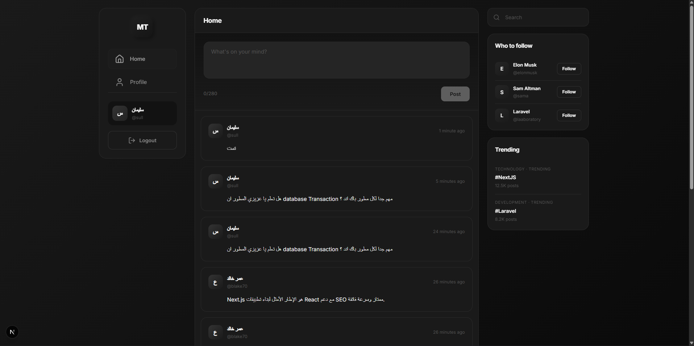

# Mini Twitter - الواجهة الأمامية

<div align="center">

   

**تحدي 30 يوم 30 مشروع - اليوم 11**

</div>

---

## نظرة عامة

واجهة أمامية حديثة وأنيقة لمنصة Mini Twitter. تصميم Monochrome فريد مع تجربة مستخدم سلسة، تدعم نشر التغريدات، إدارة الملف الشخصي، ونظام مصادقة متكامل.



## المميزات

| الميزة               | الوصف                              |
| -------------------- | ---------------------------------- |
| 🎨 تصميم Monochrome  | تصميم أبيض وأسود أنيق وعصري        |
| 📱 متجاوب            | يعمل على جميع أحجام الشاشات        |
| 🔐 مصادقة كاملة      | تسجيل دخول، تسجيل حساب، تسجيل خروج |
| 📝 نظام تغريدات      | إنشاء، تعديل، حذف التغريدات        |
| 👤 ملف شخصي          | عرض وتعديل البيانات الشخصية        |
| 🔒 تغيير كلمة المرور | تأمين الحساب                       |
| 🔔 إشعارات Toast     | إشعارات فورية باللغة العربية       |

## المميزات التقنية

`Next.js 14 App Router` `React Hook Form` `Axios Interceptors` `Context API` `Lucide Icons` `Responsive Design`

## الصفحات

### الصفحة الرئيسية

- عرض التايملاين مع جميع التغريدات
- نموذج إنشاء تغريدة جديدة (للمسجلين)
- بانر تسجيل الدخول (للضيوف)

### تسجيل الدخول

- دعم تسجيل الدخول بالإيميل أو اسم المستخدم
- أيقونات للحقول
- إظهار/إخفاء كلمة المرور

### إنشاء حساب

- نموذج تسجيل متكامل
- التحقق من صحة البيانات
- تأكيد كلمة المرور

### الملف الشخصي

- عرض بيانات المستخدم
- تعديل البيانات في Modal
- تغيير كلمة المرور
- عرض تغريداتي مع إمكانية التعديل والحذف

## هيكل المشروع

```
frontend/
├── app/
│   ├── page.tsx              # الصفحة الرئيسية
│   ├── login/page.tsx        # صفحة تسجيل الدخول
│   ├── register/page.tsx     # صفحة إنشاء حساب
│   ├── profile/page.tsx      # صفحة الملف الشخصي
│   ├── layout.tsx            # Layout الرئيسي
│   └── globals.css           # الأنماط العامة
├── components/
│   ├── Sidebar.tsx           # الشريط الجانبي
│   ├── RightSidebar.tsx      # الشريط الأيمن
│   ├── Tweet.tsx             # كارت التغريدة
│   └── CreateTweetForm.tsx   # نموذج إنشاء تغريدة
├── context/
│   ├── AuthContext.tsx       # سياق المصادقة
│   └── ToastContext.tsx      # سياق الإشعارات
└── lib/
    ├── axios.ts              # إعداد Axios
    └── utils.ts              # دوال مساعدة
```

## التثبيت والإعداد

### 1. تثبيت الحزم

```bash
npm install
```

### 2. إعداد البيئة

تأكد من تشغيل الخادم الخلفي على `http://127.0.0.1:8000`

### 3. تشغيل التطبيق

```bash
npm run dev
```

> التطبيق يعمل على: `http://localhost:3000`

## الحزم المستخدمة

| الحزمة            | الوظيفة              |
| ----------------- | -------------------- |
| `next`            | إطار العمل الرئيسي   |
| `react`           | مكتبة واجهة المستخدم |
| `axios`           | طلبات HTTP           |
| `react-hook-form` | إدارة النماذج        |
| `lucide-react`    | الأيقونات            |
| `tailwindcss`     | أنماط CSS            |

## التصميم

- **لوحة الألوان**: Monochrome (أسود، أبيض، رمادي)
- **الخطوط**: Inter
- **التأثيرات**: Glassmorphism، ظلال ناعمة، انتقالات سلسة
- **Responsive**: يدعم Mobile، Tablet، Desktop

---

<div align="center">

**صُنع ضمن تحدي 30 يوم 30 مشروع**

</div>
