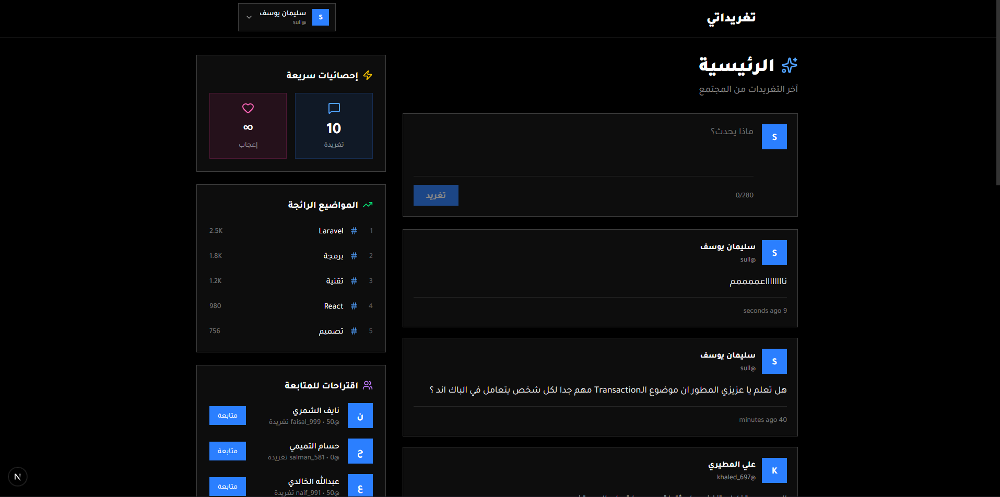

# تغريداتي - Frontend

<div align="center">

   

**تحدي 30 يوم 30 مشروع - اليوم 12**

</div>

---



## نظرة عامة

تطبيق تغريدات مصغر - واجهة أمامية عربية حديثة لمنصة تواصل اجتماعي. التصميم داكن ومتجاوب مع دعم كامل للغة العربية.

## المميزات

### التصميم

- تصميم داكن عصري (Dark Theme)
- دعم كامل للغة العربية (RTL)
- خط Tajawal العربي
- تصميم متجاوب لجميع الشاشات

### المصادقة

- تسجيل حساب جديد
- تسجيل الدخول (بريد أو اسم مستخدم)
- نافذة تسجيل دخول منبثقة للزوار
- تأكيد قبل تسجيل الخروج

### التغريدات

- نشر تغريدات جديدة
- عرض، تعديل، حذف التغريدات
- تعديل مباشر (Inline Editing)
- تأكيد قبل الحذف

### الملف الشخصي

- لوحة تحكم متكاملة
- تعديل البيانات الشخصية
- تغيير كلمة المرور
- عرض الإحصائيات

### نظام المتابعة

- متابعة وإلغاء متابعة المستخدمين
- اقتراحات للمتابعة من الـ API
- عرض الملفات الشخصية العامة

### الـ Sidebar

- إحصائيات سريعة
- المواضيع الرائجة (Trending)
- اقتراحات المتابعة
- دعوة للتسجيل للزوار

## التقنيات المستخدمة

| التقنية  | الوصف                     |
| --------------- | ------------------------------ |
| Next.js 14+     | إطار React مع App Router |
| TypeScript      | أمان الأنواع        |
| Tailwind CSS    | التصميم                 |
| Axios           | طلبات الـ API          |
| Lucide React    | الأيقونات             |
| React Hot Toast | الإشعارات             |

## التثبيت والإعداد

### 1. الانتقال لمجلد الـ Frontend

```bash
cd day12-social-app/frontend
```

### 2. تثبيت الحزم

```bash
npm install
```

### 3. إعداد البيئة

أنشئ ملف `.env.local`:

```env
NEXT_PUBLIC_API_URL=http://127.0.0.1:8000/api
```

### 4. تشغيل السيرفر

```bash
npm run dev
```

> الموقع يعمل على: `http://localhost:3000`

## الصفحات

| الرابط          | الوصف                         | الحماية |
| --------------------- | ---------------------------------- | -------------- |
| `/`                 | الصفحة الرئيسية      | عام         |
| `/login`            | تسجيل الدخول            | عام         |
| `/register`         | تسجيل حساب جديد       | عام         |
| `/profile`          | لوحة التحكم              | Token          |
| `/users/[username]` | الملف الشخصي العام | عام         |
| `/tweets/[id]`      | صفحة تغريدة واحدة   | عام         |

## هيكل المشروع

```
frontend/
├── app/
│   ├── page.tsx              # الرئيسية
│   ├── layout.tsx            # التخطيط العام
│   ├── globals.css           # الأنماط العامة
│   ├── login/page.tsx        # تسجيل الدخول
│   ├── register/page.tsx     # التسجيل
│   ├── profile/page.tsx      # لوحة التحكم
│   ├── users/[username]/     # الملف العام
│   └── tweets/[id]/          # صفحة تغريدة
├── components/
│   ├── Navbar.tsx            # شريط التنقل
│   ├── TweetCard.tsx         # بطاقة التغريدة
│   ├── CreateTweetForm.tsx   # نموذج التغريد
│   ├── FollowButton.tsx      # زر المتابعة
│   └── LoginModal.tsx        # نافذة تسجيل الدخول
├── contexts/
│   ├── AuthContext.tsx       # سياق المصادقة
│   └── ModalContext.tsx      # سياق النوافذ
├── lib/
│   └── axios.ts              # إعداد Axios
└── providers/
    └── ToastProvider.tsx     # مزود الإشعارات
```

## الصفحة الرئيسية

- شريط تنقل مع قائمة منسدلة للمستخدم
- نموذج إنشاء تغريدة
- قائمة التغريدات
- Sidebar مع الإحصائيات والاقتراحات

### لوحة التحكم

- 4 تابات: تغريداتي، الملف الشخصي، تغيير كلمة المرور، تسجيل الخروج
- تعديل inline للتغريدات
- أزرار حذف وتعديل وعرض

---

<div align="center">

**صنع ضمن تحدي 30 يوم 30 مشروع**

</div>
