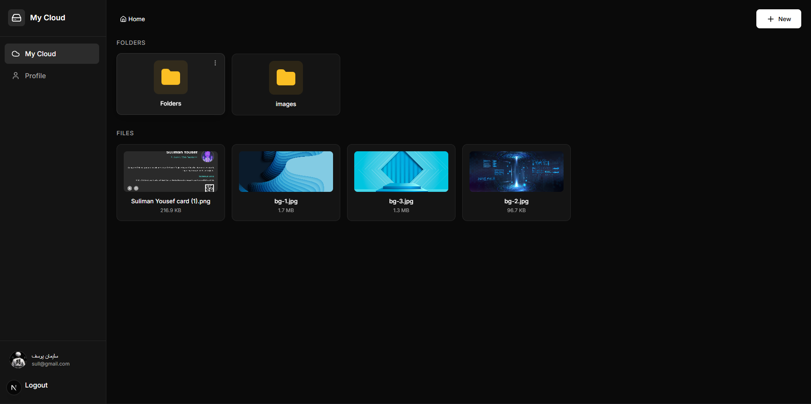

# سحابتي - Frontend

<div align="center">

   

**تحدي 30 يوم 30 مشروع - اليوم 13**

</div>

---



## نظرة عامة

"سحابتي" هو تطبيق تخزين سحابي عصري - واجهة أمامية عربية متطورة تتيح للمستخدمين إدارة ملفاتهم بسهولة. التصميم داكن (Dark Theme) زجاجي ومتجاوب بالكامل مع دعم اللغة العربية.

## المميزات

### التصميم والواجهة

- تصميم داكن عصري (Dark Theme) بلمسة زجاجية (Glassmorphism).
- دعم كامل للغة العربية (RTL).
- خط Tajawal العربي الأنيق.
- واجهة متجاوبة تعمل بكفاءة على جميع الشاشات.

### المصادقة (Authentication)

- تسجيل حساب جديد وتسجيل الدخول.
- أيقونات إظهار/إخفاء كلمة المرور في جميع حقول الإدخال.
- نظام حماية يمنع الزوار غير المسجلين من الوصول للوحة التحكم.

### إدارة المجلدات (Folders)

- إنشاء مجلدات متداخلة بلا حدود.
- مسار التنقل (Breadcrumbs) للتنقل السلس بين المجلدات.
- حذف المجلدات مع تأكيد قبل الحذف.

### إدارة الملفات (Files)

- رفع الملفات (Images, Documents, PDFs).
- عرض الصور كمعاينة مصغرة (Thumbnails) مباشرة في الواجهة.
- تحميل الملفات أو حذفها بسهولة.

### نافذة المعاينة (Preview Modal)

- فتح معاينة مكبرة للصور عند الضغط عليها.
- عرض تفاصيل دقيقة (اسم الملف، الحجم، النوع، تاريخ الرفع).
- أزرار سريعة للتحميل أو الحذف داخل النافذة.

### الملف الشخصي (Profile)

- لوحة تحكم لتعديل الاسم، اسم المستخدم، والبريد الإلكتروني.
- نظام رفع وتغيير الصورة الشخصية (Avatar) مع معاينة فورية.
- تغيير كلمة المرور من داخل البروفايل.

## التقنيات المستخدمة

| التقنية         | الوصف                                  |
| --------------- | -------------------------------------- |
| Next.js 15+     | أحدث إصدار من إطار React مع App Router |
| TypeScript      | لضمان أمان الأنواع وجودة الكود         |
| Tailwind CSS    | للتنسيق العصري والسريع                 |
| Axios           | لإدارة طلبات الـ API والمصادقة         |
| Lucide React    | مكتبة الأيقونات العصرية                |
| React Hot Toast | لعرض التنبيهات التفاعلية               |

## التثبيت والإعداد

### 1. الانتقال لمجلد الـ Frontend

```bash
cd day13-my-drive/frontend
```

### 2. تثبيت الحزم

```bash
npm install
```

### 3. إعداد البيئة

أنشئ ملف `.env.local`:

```env
NEXT_PUBLIC_BACKEND_URL=http://127.0.0.1:8000
```

### 4. تشغيل السيرفر

```bash
npm run dev
```

> الموقع يعمل على: `http://localhost:3000`

## الصفحات

| الرابط         | الوصف                          | الحماية |
| -------------- | ------------------------------ | ------- |
| `/dashboard`   | لوحة التحكم الرئيسية (الملفات) | Token   |
| `/folder/[id]` | محتويات مجلد معين              | Token   |
| `/profile`     | إعدادات الملف الشخصي           | Token   |
| `/login`       | صفحة تسجيل الدخول              | عام     |
| `/register`    | صفحة إنشاء حساب جديد           | عام     |

## هيكل المشروع

```
frontend/
├── app/
│   ├── (auth)/             # تسجيل الدخول والتسجيل
│   ├── (dashboard)/        # لوحة التحكم والمجلدات والبروفايل
│   ├── layout.tsx          # التنسيق العام والمزودات
│   └── globals.css         # الأنماط المخصصة (Custom UI Kit)
├── components/
│   ├── Sidebar.tsx         # القائمة الجانبية مع الأفاتار
│   ├── FileCard.tsx        # بطاقة عرض الملف
│   ├── FolderCard.tsx      # بطاقة عرض المجلد
│   ├── FilePreviewModal.tsx # نافذة المعاينة المتطورة
│   └── UploadFileModal.tsx  # نافذة رفع الملفات
├── contexts/
│   └── AuthContext.tsx     # إدارة حالة المستخدم الـ Global
├── lib/
│   ├── api.ts              # دوال الاتصال بالرأس (Services)
│   └── axios.ts            # تهيئة Axios مع الـ Interceptors
└── types/                  # تعريفات الـ TypeScript Interfaces
```

---

<div align="center">

**صنع ضمن تحدي 30 يوم 30 مشروع**

</div>
