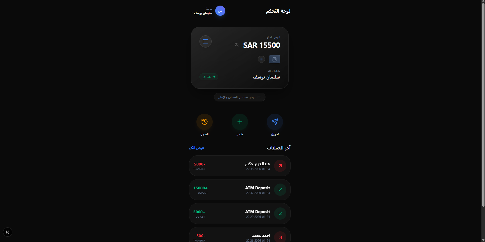

# PayFlow App - الواجهة الأمامية

<div align="center">

   

**تحدي 30 يوم 30 مشروع - اليوم 15**

</div>

---

## فكرة المشروع

تطبيق "PayFlow" هو محفظة رقمية عصرية تهدف إلى تقديم تجربة مستخدم فائقة الجمال والسهولة لإدارة العمليات المالية اليومية. يركز التطبيق على الأناقة البصرية (Luxury Dark UI) والخصوصية التامة للمستخدم.

<div align="center">



</div>

## ما يميز التطبيق

| الميزة               | الوصف                                                            |
| :------------------- | :--------------------------------------------------------------- |
| **تصميم أسطوري**     | بطاقة بنكية بتصميم Stealth Luxury مع تأثيرات ضوئية وحركية متقدمة |
| **نظام الخصوصية**    | إمكانية إخفاء الرصيد وحماية بيانات الحساب في صفحة منفصلة         |
| **إدارة المستفيدين** | نظام متكامل لإضافة وتعديل وحذف جهات الاتصال المالية              |
| **سجل تفاعلي**       | عرض تاريخي للعمليات مع تمييز لوني دقيق للوارد والمنصرف           |
| **تجربة مستخدم RTL** | دعم كامل للغة العربية والاتجاه من اليمين لليسار بتناسق فائق      |

## المميزات التقنية

- **الواجهة:** Next.js 15 مع App Router.
- **التنسيق:** Tailwind CSS v4 مع نظام ألوان مخصص.
- **الحركات:** Framer Motion لتنفيذ الانتقالات السلسة وتأثيرات البطاقة.
- **إدارة الحالة:** Zustand لإدارة بيانات المستخدم والتوثيق.
- **الأيقونات:** Lucide-React لمجموعة أيقونات متناسقة.

## هيكل الصفحات

- `Dashboard`: الملخص المالي وأدوات التحكم السريعة.
- `Transfer`: نظام تحويل ذكي متعدد الخطوات.
- `Deposit`: واجهة شحن رصيد فورية.
- `Beneficiaries`: إدارة شاملة لجهات الاتصال.
- `History`: كشف حساب تفصيلي بمحرك بحث وفلترة.
- `Profile`: إدارة المعلومات الشخصية بتصميم عرضي حديث.
- `Account Details`: صفحة محمية لعرض الـ IBAN ورقم الحساب.

## التثبيت والتشغيل

### 1. تثبيت الحزم

```bash
npm install
```

### 2. تشغيل بيئة التطوير

```bash
npm run dev
```

### 3. بناء نسخة الإنتاج

```bash
npm run build
```

---

<div align="center">

**صنع ضمن تحدي 30 يوم 30 مشروع**

</div>
