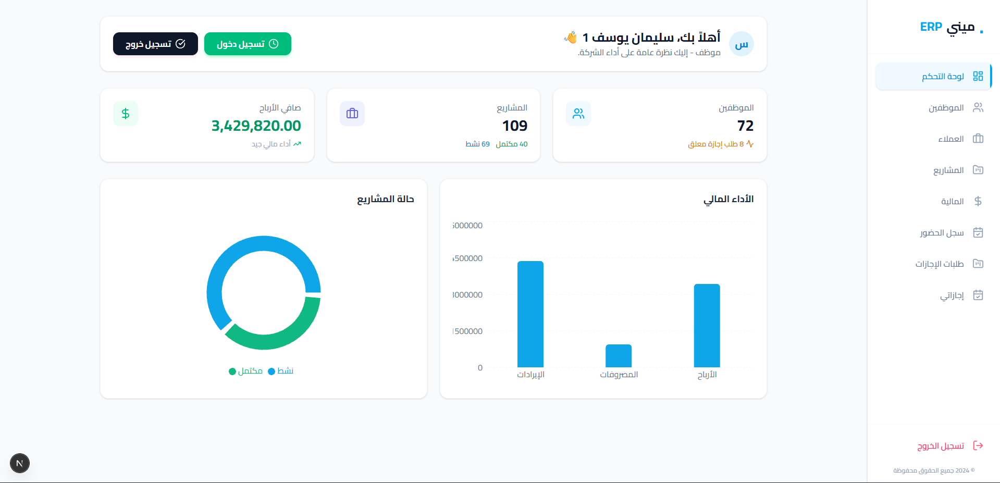

# Mini ERP - واجهة المستخدم

<div align="center">

   

**لوحة تحكم حديثة لإدارة الموارد المؤسسية**



</div>

---

## نظرة عامة

هذه هي واجهة المستخدم (Client Side) لنظام **Mini ERP**، تم بناؤها باستخدام **Next.js** و **Tailwind CSS**. توفر تجربة مستخدم سلسة وحديثة لإدارة كافة جوانب المؤسسة، من الموارد البشرية وحتى التقارير المالية، مع تركيز كبير على سهولة الاستخدام والعرض البصري للبيانات.

## المميزات الرئيسية

### لوحة تحكم تفاعلية (Dashboard)

- رسوم بيانية (Charts) توضح الإيرادات والمصروفات وحالة المشاريع.
- بطاقات إحصائيات حية (Live Stats) لعدد الموظفين، الأرباح، والطلبات المعلقة.
- تخصيص التحية بناءً على المستخدم ودوره الوظيفي.

### إدارة الموظفين والعملاء

- قوائم بيانات متطورة (DataTables) مع خاصية البحث والصفحات.
- نوافذ منبثقة (Modals) لإضافة وتعديل بيانات الموظفين والعملاء بلمسة واحدة.
- حماية العمليات الحرجة (مثل الحذف) بنوافذ تأكيد.

### نظام الحضور والإجازات

- تسجيل الدخول/الخروج بضغطة زر مع تسجيل الوقت الفعلي.
- نموذج تقديم إجازات يدعم جميع الأنواع (سنوية، مرضية، طارئة).
- لوحة خاصة للمدير للمواقفة على الطلبات أو رفضها مع ذكر السبب.

### إدارة المشاريع والفواتير

- تتبع حالة المشاريع (نشط، مكتمل) وربطها بالعملاء والمدراء.
- نظام فواتير متكامل يوضح حالات الدفع (مدفوعة، غير مدفوعة، متأخرة).

## التقنيات المستخدمة

- **Next.js (App Router)**: لبناء هيكلية سريعة وقابلة للتوسع.
- **Tailwind CSS**: لتصميم واجهات عصرية ومتجاوبة.
- **Axios**: للربط مع الـ API الخلفي.
- **Recharts**: لعرض الرسوم البيانية والتحليلات.
- **Lucide React**: مكتبة أيقونات عصرية وخفيفة.
- **React Hot Toast**: لنظام التنبيهات والتفاعل مع المستخدم.

## هيكل المشروع

```
frontend/
├── app/
│   ├── (auth)/             # صفحات تسجيل الدخول
│   ├── (dashboard)/        # صفحات النظام الداخلية (محمية)
│   │   ├── dashboard/      # الصفحة الرئيسية
│   │   ├── employees/      # إدارة الموظفين
│   │   ├── projects/       # المشاريع
│   │   ├── attendance/     # سجل الحضور
│   │   └── ...
│   └── layout.tsx          # التخطيط العام
├── components/
│   ├── ui/                 # مكونات قابلة لإعادة الاستخدام (أزرار، حقول، جداول)
│   └── layout/             # الشريط الجانبي والرأس
├── lib/
│   └── axios.ts            # إعدادات الاتصال بالخادم
└── public/                 # الصور والملفات الثابتة
```

## التثبيت والتشغيل

### 1. تثبيت الاعتمادات

```bash
npm install
```

### 2. إعداد المتغيرات

تأكد من أن الخادم الخلفي (Backend) يعمل على المنفذ الافتراضي `http://localhost:8000` أو قم بتعديل `lib/axios.ts` إذا لزم الأمر.

### 3. تشغيل وضع التطوير

```bash
npm run dev
```

افتح المتصفح على الرابط: [http://localhost:3000](http://localhost:3000)

---

<div align="center">

**تحدي 30 يوم 30 مشروع - اليوم 18**

</div>
