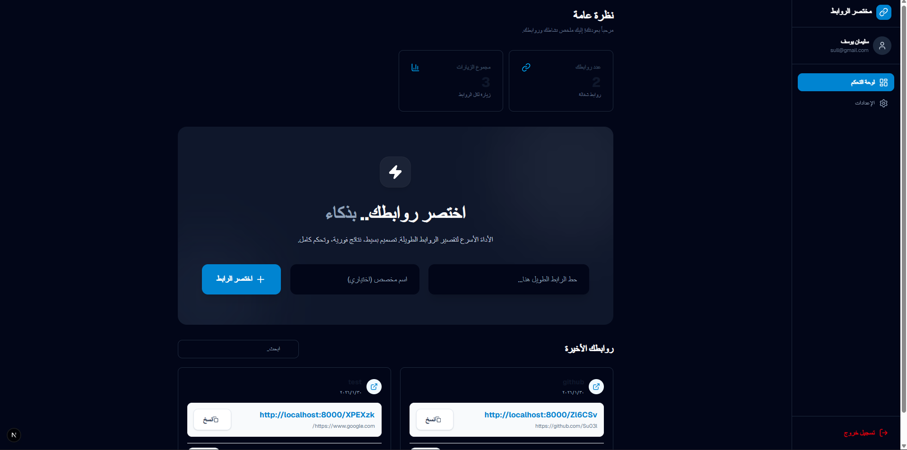

# URL Shortener - الواجهة الأمامية

<div align="center">

  

**تحدي 30 يوم 30 مشروع - اليوم 19**

</div>

---

<div align="center"> 
  
</div>

---

## نظرة عامة

واجهة مستخدم عصرية وسريعة لنظام "مختصر الروابط"، مبنية باستخدام أحدث تقنيات الويب (Next.js 14). توفر تجربة مستخدم سلسة (SPA) لإدارة الروابط ومتابعة الإحصائيات، مع دعم كامل للغة العربية (RTL) وتصميم متجاوب لجميع الأجهزة.

## المميزات الرئيسية

| الميزة                | الوصف                                                                  |
| :-------------------- | :--------------------------------------------------------------------- |
| **لوحة تحكم تفاعلية** | عرض فوري لعدد الروابط والزيارات بتصميم بسيط وجذاب                      |
| **إدارة سهلة**        | إنشاء، تعديل، وحذف الروابط بضغطة زر وبدون إعادة تحميل الصفحة           |
| **نسخ سريع**          | زر مخصص لنسخ الرابط المختصر للحافظة فوراً                              |
| **بحث فوري**          | تصفية الروابط والبحث عنها بسرعة فائقة                                  |
| **دعم العربية**       | واجهة عربية بالكامل مع ضبط الاتجاهات (RTL) واستخدام خطوط مريحة للقراءة |

## التقنيات المستخدمة

- **Framework**: Next.js 14 (App Router)
- **Language**: TypeScript
- **Styling**: Tailwind CSS v4
- **Icons**: Lucide React
- **HTTP Client**: Axios
- **Notifications**: React Hot Toast

## هيكل المشروع

```
frontend/
├── app/
│   ├── (auth)/             # صفحات الدخول والتسجيل
│   ├── dashboard/          # لوحة التحكم الرئيسية
│   ├── layout.tsx          # التخطيط العام
│   └── globals.css         # الأنماط العامة
├── components/
│   ├── ui/                 # عناصر الواجهة (أزرار، حقول إدخال)
│   ├── dashboard/          # مكونات لوحة التحكم (بطاقات الروابط، الإحصائيات)
├── context/
│   └── AuthContext.tsx     # إدارة حالة المستخدم
├── lib/
│   └── axios.ts            # إعدادات الاتصال بالخادم
└── types/
    └── index.ts            # تعريف أنواع البيانات
```

## التشغيل والتثبيت

### 1. تثبيت الحزم

```bash
npm install
```

### 2. إعداد المتغيرات

تأكد من أن الخادم الخلفي يعمل على المنفذ الافتراضي، أو قم بتعديل `lib/axios.ts`.

### 3. تشغيل وضع التطوير

```bash
npm run dev
// يفتح التطبيق عادةً على http://localhost:3000
```

### 4. بناء النسخة النهائية (Production)

```bash
npm run build
npm start
```
