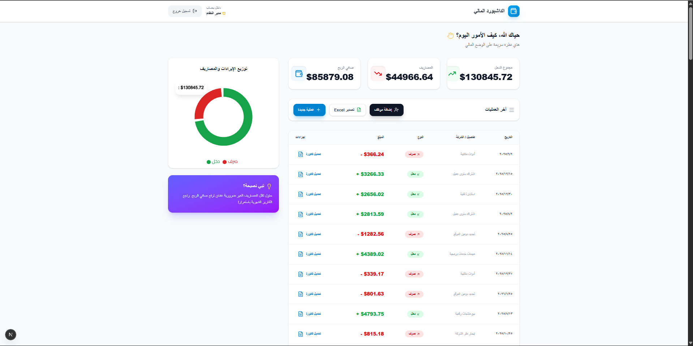

# Financial Dashboard - واجهة المستخدم

<div align="center">

   

**تحدي 30 يوم 30 مشروع - اليوم 20**

</div>

---

## نظرة عامة

واجهة مستخدم حديثة وسريعة لنظام "Financial Dashboard"، مبنية لاستعراض البيانات المالية وإدارتها بسلاسة. تم تصميم الواجهة لتعمل باللغة العربية (RTL) بشكل كامل مع دعم تجربة مستخدم "بريميوم" من خلال الرسوم البيانية، الجداول التفاعلية، والنوافذ المنبثقة.

<div align="center">
  
</div>

## المميزات الرئيسية

| الميزة                  | الوصف                                                        |
| :---------------------- | :----------------------------------------------------------- |
| **تصميم عربي كامل**     | دعم RTL، خطوط عربية (Cairo)، ونصوص باللهجة المحلية           |
| **إدارة كلمات المرور**  | إمكانية إظهار/إخفاء كلمات المرور لسهولة الاستخدام            |
| **رسوم بيانية تفاعلية** | Pie Charts تعرض توزيع الدخل والمصاريف بشكل بصري جذاب         |
| **تصدير الملفات**       | أزرار مباشرة لتحميل تقارير Excel وفواتير PDF                 |
| **تجربة مستخدم سلسة**   | استخدام Modals لإضافة البيانات دون مغادرة الصفحة (AJAX-like) |

## التقنيات المستخدمة

- **Framework**: Next.js 14 (App Router)
- **Styling**: Tailwind CSS
- **Icons**: Lucide React (Vector Icons)
- **State Management**: React Context API
- **HTTP Client**: Axios (with Interceptors)
- **Visualization**: Recharts

## صفحات المشروع

### 1. الصفحة الرئيسية (Landing Page)

صفحة تعريفية بالنظام، تعرض أهم المميزات مع زر توجيه للوحة التحكم.

### 2. تسجيل الدخول (Login)

صفحة آمنة ومصممة بعناية، تدعم إظهار كلمة المرور وتوجيه المستخدم حسب صلاحيته (Admin/Employee).

### 3. لوحة التحكم (Dashboard)

- **بطاقات الإحصائيات**: تعرض مجمل الدخل، المصاريف، وصافي الربح.
- **الرسم البياني**: يوضح نسبة الإيرادات للمصروفات.
- **جدول العمليات**: يعرض آخر العمليات مع إمكانية تحميل الفاتورة لكل عملية.
- **الإجراءات**: أزرار لإضافة عملية جديدة أو إضافة موظف (للمدير فقط).

## التثبيت والتشغيل

### 1. تثبيت الاعتمادات

```bash
npm install
```

### 2. تشغيل نسخة التطوير

```bash
npm run dev
```

افتح المتصفح على: [http://localhost:3000](http://localhost:3000)

### 3. بناء النسخة الإنتاجية

```bash
npm run build
npm start
```

---

<div align="center">

**صنع ضمن تحدي 30 يوم 30 مشروع**

</div>
