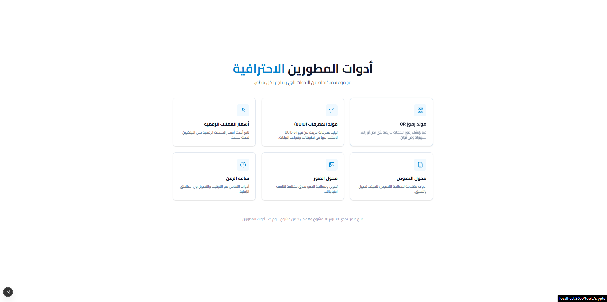

# أدوات المطورين الاحترافية



## تفاصيل المشروع

هذا المشروع هو عبارة عن مجموعة متكاملة من الأدوات التي يحتاجها المطورون في أعمالهم اليومية، تم تجميعها في واجهة حديثة وسهلة الاستخدام. يهدف المشروع لتوفير الوقت والجهد من خلال تقديم أدوات دقيقة وسريعة.

### الأدوات المتوفرة

1. **مولد رموز QR**
   إنشاء رموز استجابة سريعة لأي نص أو رابط بسهولة، مع إمكانية تحميلها بصيغ مختلفة مثل SVG و PNG لاستخدامها في التصاميم والمطبوعات.

2. **مولد المعرفات (UUID)**
   أداة لتوليد معرفات فريدة من نوع UUID v4، وهي ضرورية لإنشاء مفاتيح أساسية في قواعد البيانات أو معرفات جلسات المستخدمين.

3. **أسعار العملات الرقمية**
   متابعة لحظية لأحدث أسعار العملات الرقمية (مثل البيتكوين) مقابل الدولار واليورو والجنيه الإسترليني بدقة عالية.

4. **محول النصوص**
   أدوات متقدمة لمعالجة النصوص، تشمل تنظيف النصوص، تحويل حالة الأحرف، وتنسيق النصوص لتكون جاهزة للاستخدام في الروابط (Slugs).

5. **محول الصور**
   أدوات لمعالجة الصور وإنشائها، مما يساعد المطورين والمصممين على اختبار الواجهات أو تعديل الصور بسرعة.

6. **ساعة الزمن**
   أدوات للتعامل مع التوقيت، تتيح عرض الوقت بصيغ مقروءة للبشر (مثل "منذ 5 ساعات" أو "بعد يومين") مع دعم كامل للغة العربية.

## المميزات

- واجهة مستخدم عصرية وسهلة الاستخدام.
- دعم كامل للغة العربية.
- سرعة عالية في الأداء.
- تصميم متجاوب يعمل على جميع الأجهزة.

## التثبيت والإعداد

### 1. تثبيت الحزم

قم بتشغيل الأمر التالي في موجه الأوامر لتثبيت جميع المكتبات اللازمة:

```bash
npm install
```

### 2. تشغيل المشروع

لتشغيل المشروع محلياً:

```bash
npm run dev
```

بعد ذلك، افتح المتصفح على الرابط: `http://localhost:3000`

### 3. بناء المشروع

لتحضير المشروع للبيئة الإنتاجية:

```bash
npm run build
npm start
```
