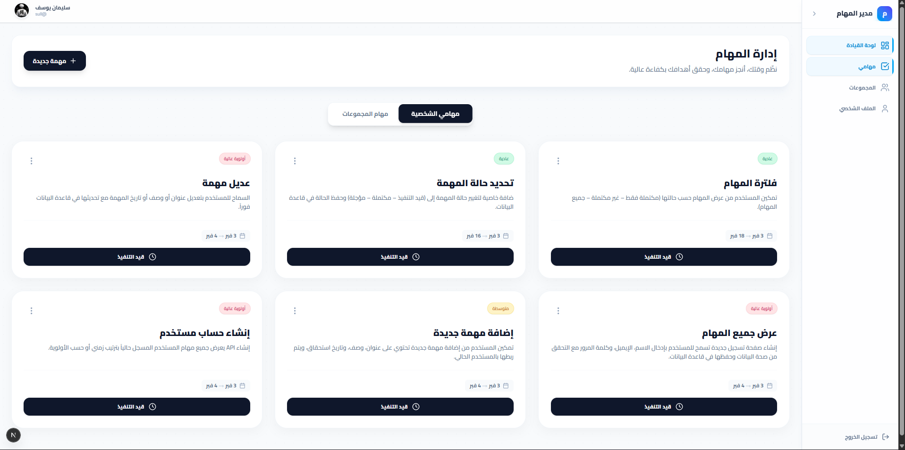

# Collaborative Task Manager UI - الواجهة الأمامية

<div align="center">

  

**تحدي 30 يوم 30 مشروع - اليوم 22**

</div>

---

## نظرة عامة

واجهة مستخدم حديثة وتفاعلية لإدارة المهام والمجموعات، مصممة لتقديم تجربة مستخدم سلسة ("Premium Feel") مع دعم كامل للغة العربية (RTL). تعتمد على Next.js 14 (App Router) لتوفير أداء عالي وتنقل سريع.

<br>



<br>

## المميزات الرئيسية

- **لوحة تحكم شاملة**: عرض لملخص المهام، المجموعات النشطة، والإحصائيات.
- **إدارة المجموعات**: واجهة لإنشاء المجموعات، إدارة الأعضاء، وتوزيع المهام.
- **تفاصيل المهام**: صفحة مخصصة لكل مهمة تحتوي على المحادثات (التعليقات)، المرفقات، وحالة الإنجاز.
- **تجربة بصرية غنية**: استخدام Glassmorphism، تأثيرات Hover تفاعلية، وألوان متناسقة لتمييز الأولويات.

## التقنيات المستخدمة

- **Next.js 14**: إطار العمل الأساسي (App Router).
- **TypeScript**: لضمان كتابة كود آمن وقابل للصيانة.
- **Tailwind CSS**: لتنسيق الواجهة بسرعة ومرونة.
- **Lucide React**: مكتبة أيقونات عصرية وخفيفة.
- **Axios**: للتعامل مع الـ API الخلفي.
- **React Hot Toast**: لعرض التنبيهات والرسائل المنبثقة.

## هيكل المشروع

```
frontend/
├── app/
│   ├── dashboard/           # صفحات لوحة التحكم (Groups, Tasks, Settings)
│   ├── (auth)/              # صفحات الدخول والتسجيل
│   └── page.tsx             # الصفحة الرئيسية
├── components/              # المكونات المعاد استخدامها (Cards, Modals...)
├── lib/                     # إعدادات (Axios, Utils)
└── public/                  # الصور والملفات الثابتة
```

## التشغيل

### 1. تثبيت الاعتماديات

```bash
npm install
```

### 2. تشغيل المطور

```bash
npm run dev
```

افتح المتصفح على [http://localhost:3000](http://localhost:3000)

---

<div align="center">

**صنع ضمن تحدي 30 يوم 30 مشروع**

</div>
