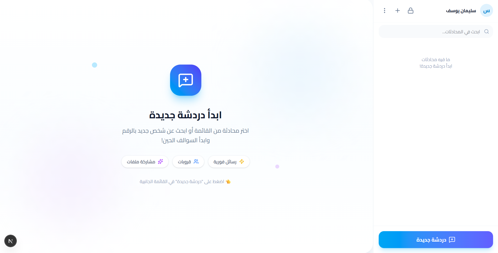

# LiveChat Frontend - الواجهة الأمامية

<div align="center">

  

**تحدي 30 يوم 30 مشروع - اليوم 23**

</div>

---

## نظرة عامة

### LiveChat App

تطبيق محادثة فوري عصري يهدف لربط الأشخاص ببعضهم البعض بسرعة وسهولة. يتميز التطبيق بواجهة مستخدم جذابة وسريعة الاستجابة، تدعم المحادثات الفردية والجماعية مع تحديثات لحظية.



## المميزات

- **محادثة فورية (Real-time):** استقبال وإرسال الرسائل لحظياً باستخدام Laravel Reverb & Echo.
- **واجهة عصرية:** تصميم نظيف ومريح للعين باستخدام TailwindCSS v4.
- **إدارة المجموعات:** إنشاء وإدارة مجموعات الدردشة بسهولة.
- **حماية الخصوصية:** دعم PIN للمحادثات الخاصة.
- **متجاوب:** يعمل بكفاءة على جميع الأجهزة (موبايل، تابلت، ديسكتوب).

## التقنيات المستخدمة

- **Framework:** Next.js 16 (App Router)
- **Library:** React 19
- **Styling:** TailwindCSS v4
- **Real-time:** Laravel Echo & Pusher JS

## التثبيت والإعداد

### 1. تثبيت الحزم

```bash
npm install
```

### 2. إعداد البيئة

تأكد من إعداد ملف `.env.local` لربطه بالباك اند:

```env
NEXT_PUBLIC_BACKEND_URL=http://localhost:8000
NEXT_PUBLIC_REVERB_APP_KEY=your_app_key
NEXT_PUBLIC_REVERB_HOST=localhost
NEXT_PUBLIC_REVERB_PORT=8080
NEXT_PUBLIC_REVERB_SCHEME=http
```

### 3. تشغيل المشروع

```bash
npm run dev
```

افتح المتصفح على [http://localhost:3000](http://localhost:3000) واستمتع بالتجربة!

---

<div align="center">

**صنع ضمن تحدي 30 يوم 30 مشروع**

</div>
