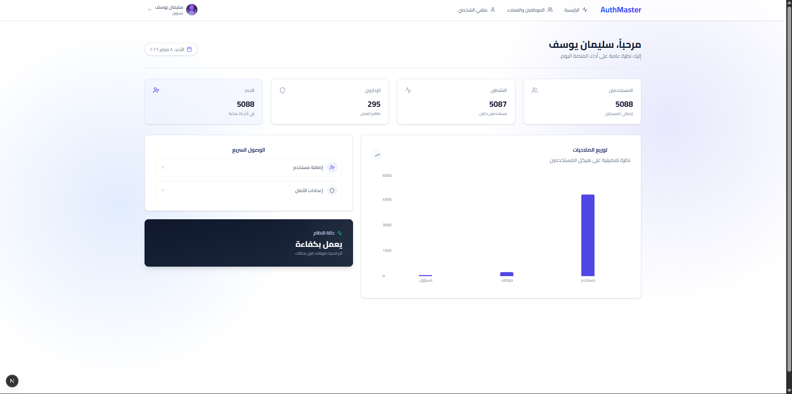

# نظام المصادقة وإدارة المستخدمين المتقدم (Advanced Auth System)

    

نظام متكامل وقوي للمصادقة وإدارة المستخدمين، مبني باستخدام أحدث تقنيات الويب. يركز هذا المشروع على الأمان العالي، تجربة المستخدم السلسة، وتصميم عصري (Glassmorphism).



## نظرة عامة

يقدم هذا التطبيق حلاً شاملاً لإدارة المستخدمين وعمليات تسجيل الدخول. تم تصميمه ليكون قابلاً للتوسع وآمناً، ويتميز بقدرات متقدمة مثل المصادقة الثنائية (2FA)، التحكم في الوصول المبني على الأدوار (RBAC)، وعرض البيانات والرسوم البيانية بشكل لحظي.

## المميزات الرئيسية

### المصادقة والأمان

- **تسجيل دخول وإنشاء حساب آمن**: تم تنفيذه باستخدام Zod للتحقق القوي من صحة البيانات ومعالجة الأخطاء.
- **التحقق الثنائي (2FA)**: يضيف طبقة حماية إضافية عن طريق طلب رمز OTP يرسل للبريد الإلكتروني عند الدخول.
- **تفعيل الحساب**: خطوة إلزامية للتحقق من البريد الإلكتروني بعد التسجيل لضمان مصداقية المستخدم.
- **استعادة كلمة المرور المتقدمة**: مسار آمن من 3 خطوات (طلب بالإيميل -> تحقق بالكود -> تغيير الباسورد) لضمان استعادة الحسابات المخترقة بأمان.
- **إدارة التوكن (Token Management)**: معالجة آمنة لرموز JWT وبيانات الجلسة باستخدام ملفات تعريف الارتباط HTTP-only واستراتيجيات التخزين المحلي.

### إدارة المستخدمين ولوحة التحكم

- **لوحة تحكم تفاعلية**: تعرض توزيع المستخدمين وإحصائيات النظام باستخدام مكتبة Recharts.
- **جدول البيانات (Data Table)**: شبكة بيانات قوية لإدارة المستخدمين مع ميزات التقسيم (Pagination)، البحث، والفلترة من جانب الخادم.
- **نظام الصلاحيات (RBAC)**: نظام أذونات دقيق يميز بين أدوار (مدير النظام، موظف، مستخدم) لتقييد الوصول للموارد الحساسة.
- **إدارة الملف الشخصي**: يمكن للمستخدمين تحديث بياناتهم الشخصية، الصورة الرمزية، وإعدادات الأمان بكل سهولة.

### واجهة المستخدم والتجربة

- **تصميم زجاجي (Glassmorphism)**: لغة تصميم عصرية تستخدم الشفافية والظلال الخلفية.
- **دعم اللغة العربية (RTL)**: واجهة معربة بالكامل تدعم التخطيط من اليمين لليسار مع محاذاة صحيحة للأيقونات والنصوص.
- **تصميم متجاوب**: تجربة استخدام مثالية على جميع الأجهزة (الجوال، التابلت، سطح المكتب).
- **تفاعلات دقيقة**: حركات وانتقالات سلسة مدعومة بـ Tailwind CSS لتعزيز تفاعل المستخدم.

## التقنيات المستخدمة

| المكون         | التقنية         | الوصف                                                             |
| -------------- | --------------- | ----------------------------------------------------------------- |
| **Framework**  | Next.js 14      | إطار عمل React للويب (App Router).                                |
| **Language**   | TypeScript      | لغة JavaScript مكتوبة بنمط ثابت لتحسين الأدوات والأمان.           |
| **Styling**    | Tailwind CSS    | إطار عمل CSS قائم على الأدوات للتطوير السريع للواجهة.             |
| **Components** | Shadcn/ui       | مكونات قابلة لإعادة الاستخدام مبنية باستخدام Radix UI و Tailwind. |
| **State**      | Zustand         | حل إدارة حالة صغير، سريع، وقابل للتوسع.                           |
| **Forms**      | React Hook Form | نماذج عالية الأداء، مرنة، وقابلة للتوسع مع سهولة التحقق.          |
| **Validation** | Zod             | مكتبة تعريف وتحقق من المخططات (Schema) تعتمد على TypeScript.      |
| **Charts**     | Recharts        | مكتبة رسوم بيانية معاد تعريفها مبنية بـ React و D3.               |
| **Icons**      | Lucide React    | أيقونات جميلة ومتسقة.                                             |

## التثبيت والإعداد

اتبع هذه الخطوات لتشغيل المشروع محلياً.

### 1. نسخ المستودع (Clone)

```bash
git clone <repository-url>
cd frontend
```

### 2. تثبيت الحزم (Dependencies)

```bash
npm install
```

### 3. إعداد البيئة (Environment)

قم بإنشاء ملف `.env.local` في المجلد الرئيسي وأضف رابط الـ API:

```env
NEXT_PUBLIC_API_URL=http://localhost:8000/api
```

### 4. تشغيل السيرفر (Development)

```bash
npm run dev
```

سيكون التطبيق متاحاً على الرابط `http://localhost:3000`.

## هيكلة المشروع

يتبع المشروع هيكلة معيارية لسهولة الصيانة.

```text
frontend/
├── src/
│   ├── app/              # صفحات وتخطيطات Next.js App Router
│   ├── components/       # مكونات الواجهة القابلة لإعادة الاستخدام
│   │   ├── auth/         # نماذج ومكونات المصادقة
│   │   ├── ui/           # عناصر الواجهة الأساسية (أزرار، حقول، بطاقات)
│   │   └── ...
│   ├── lib/              # دوال وأدوات مساعدة
│   ├── services/         # خدمات الاتصال بالـ API
│   ├── store/            # إدارة الحالة العامة (Zustand)
│   └── types/            # تعريفات أنواع TypeScript
├── public/               # الملفات الثابتة (صور، خطوط)
└── ...
```

---

تم التطوير كجزء من تحدي **30 يوم برمجة**.
