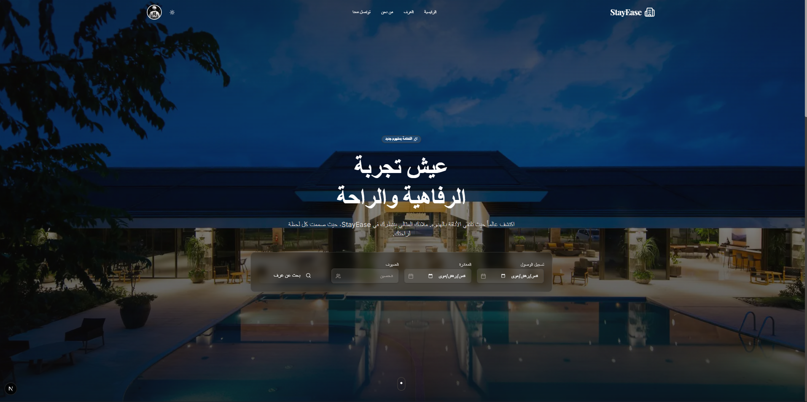

<div align="center">

# StayEase

### واجهة المستخدم لنظام إدارة الفنادق الفاخر

<p>
    <a href="#"></a>
    <a href="#"></a>
    <a href="#"></a>
    <a href="#"></a>
</p>

<p>
    
</p>

</div>

---

## نبذة عن المشروع

واجهة أمامية حديثة ومتجاوبة بالكامل مبنية باستخدام Next.js 14، مصممة لتقديم تجربة مستخدم سلسة وفاخرة لحجز الغرف وإدارة الإقامة. تدعم الواجهة اللغة العربية (RTL) بشكل كامل وتوفر لوحات تحكم مخصصة للعملاء والمسؤولين.

## أبرز الحلول التقنية

| التحدي             | الحل في StayEase                                                         |
| :----------------- | :----------------------------------------------------------------------- |
| **تجربة المستخدم** | واجهة تفاعلية ولغة تصميم فاخرة تعكس هوية الفندق مع دعم كامل للغة العربية |
| **إدارة الحالة**   | استخدام Zustand لإدارة حالة التطبيق والمصادقة بسلاسة عبر جميع الصفحات    |
| **الأداء**         | تحميل سريع وتحسين محركات البحث (SEO) بفضل تقنيات Next.js SSR و CSR       |
| **التجاوب**        | تصميم متجاوب تماماً يعمل بكفاءة على جميع الأجهزة والأحجام                |

<br>

<br>

## المميزات والصفحات

### 1. الصفحات العامة

| الصفحة            | الوصف                                                      |
| :---------------- | :--------------------------------------------------------- |
| **الرئيسية**      | واجهة ترحيبية تعرض الغرف المميزة والخدمات وآراء العملاء    |
| **البحث**         | محرك بحث متقدم لفلترة الغرف حسب التاريخ، السعر، والإطلالة  |
| **تفاصيل الغرفة** | عرض شامل لصور الغرفة، المرافق، والتقييمات مع إمكانية الحجز |
| **تواصل معنا**    | نموذج اتصال مباشر مع الإدارة عبر البريد الإلكتروني         |

### 2. لوحة تحكم العميل

| الصفحة           | الوصف                                                               |
| :--------------- | :------------------------------------------------------------------ |
| **نظرة عامة**    | ملخص للحجوزات النشطة وحالة الحساب                                   |
| **حجوزاتي**      | إدارة الحجوزات الحالية والسابقة وإمكانية الإلغاء                    |
| **الملف الشخصي** | تعديل البيانات الشخصية، تغيير كلمة المرور، وتفعيل المصادقة الثنائية |
| **المفضلة**      | قائمة الغرف التي تم حفظها للرجوع إليها لاحقاً                       |

### 3. لوحة تحكم المسؤول

| الصفحة             | الوصف                                               |
| :----------------- | :-------------------------------------------------- |
| **الرئيسية**       | إحصائيات شاملة عن الإيرادات، الحجوزات، ونسب الإشغال |
| **إدارة الغرف**    | التحكم في حالة الغرف (متاح، صيانة، تنظيف)           |
| **إدارة الحجوزات** | عرض جميع الحجوزات وتعديل حالاتها                    |

---

## خطوات التشغيل

اتبع الخطوات التالية لتشغيل النسخة المحلية:

**1. تثبيت الحزم**

```bash
npm install
```

**2. إعداد البيئة**

قم بإنشاء ملف .env.local وأضف المتغيرات التالية:

```env
NEXT_PUBLIC_API_URL=http://localhost:8000/api
NEXT_PUBLIC_STORAGE_URL=http://localhost:8000/storage
```

**3. تشغيل التطبيق**

```bash
npm run dev
```

يمكنك الآن الوصول للتطبيق عبر الرابط http://localhost:3000

<br>

<div align="center">
    تم التطوير بواسطة <a href="https://github.com/your-username">Moath</a>
</div>
